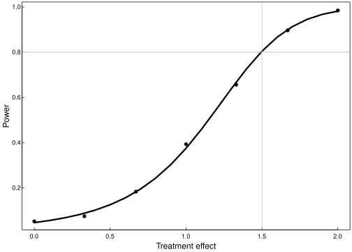

# simulation-tutorial

<?xml version="1.0" encoding="UTF-8"?>
<svg xmlns="http://www.w3.org/2000/svg" xmlns:xlink="http://www.w3.org/1999/xlink" width="504pt" height="360pt" viewBox="0 0 504 360" version="1.1">
<defs>
<g>
<symbol overflow="visible" id="glyph0-0">
<path style="stroke:none;" d=""/>
</symbol>
<symbol overflow="visible" id="glyph0-1">
<path style="stroke:none;" d="M 4.71875 -3.203125 C 4.71875 -5.421875 3.859375 -6.65625 2.46875 -6.65625 C 1.09375 -6.65625 0.21875 -5.40625 0.21875 -3.265625 C 0.21875 -1.109375 1.109375 0.140625 2.46875 0.140625 C 3.828125 0.140625 4.71875 -1.109375 4.71875 -3.203125 Z M 3.59375 -3.28125 C 3.59375 -1.46875 3.34375 -0.796875 2.453125 -0.796875 C 1.625 -0.796875 1.34375 -1.5 1.34375 -3.25 C 1.34375 -5 1.625 -5.671875 2.46875 -5.671875 C 3.328125 -5.671875 3.59375 -4.984375 3.59375 -3.28125 Z M 3.59375 -3.28125 "/>
</symbol>
<symbol overflow="visible" id="glyph0-2">
<path style="stroke:none;" d="M 1.875 -0.140625 L 1.875 -1.203125 L 0.625 -1.203125 L 0.625 0 L 1.875 0 Z M 1.875 -0.140625 "/>
</symbol>
<symbol overflow="visible" id="glyph0-3">
<path style="stroke:none;" d="M 4.765625 -2.25 C 4.765625 -3.515625 3.78125 -4.46875 2.5625 -4.46875 C 2.109375 -4.46875 1.625 -4.3125 1.578125 -4.28125 L 1.765625 -5.46875 L 4.4375 -5.46875 L 4.4375 -6.515625 L 0.84375 -6.515625 L 0.328125 -2.90625 L 1.3125 -2.90625 C 1.71875 -3.390625 1.921875 -3.5 2.40625 -3.5 C 3.265625 -3.5 3.640625 -3.09375 3.640625 -2.140625 C 3.640625 -1.21875 3.28125 -0.84375 2.40625 -0.84375 C 1.71875 -0.84375 1.453125 -1.046875 1.21875 -1.90625 L 0.125 -1.90625 C 0.40625 -0.5 1.296875 0.140625 2.4375 0.140625 C 3.71875 0.140625 4.765625 -0.90625 4.765625 -2.25 Z M 4.765625 -2.25 "/>
</symbol>
<symbol overflow="visible" id="glyph0-4">
<path style="stroke:none;" d="M 3.28125 -0.140625 L 3.28125 -6.65625 L 2.46875 -6.65625 C 2.15625 -5.53125 2.140625 -5.53125 0.75 -5.359375 L 0.75 -4.546875 L 2.171875 -4.546875 L 2.171875 0 L 3.28125 0 Z M 3.28125 -0.140625 "/>
</symbol>
<symbol overflow="visible" id="glyph0-5">
<path style="stroke:none;" d="M 4.75 -4.640625 C 4.75 -5.71875 3.765625 -6.65625 2.5625 -6.65625 C 1.25 -6.65625 0.328125 -5.84375 0.28125 -4.171875 L 1.390625 -4.171875 C 1.453125 -5.375 1.75 -5.6875 2.53125 -5.6875 C 3.25 -5.6875 3.625 -5.3125 3.625 -4.625 C 3.625 -4.125 3.375 -3.78125 2.8125 -3.46875 L 1.984375 -3 C 0.640625 -2.234375 0.21875 -1.53125 0.140625 0 L 4.703125 0 L 4.703125 -1.046875 L 1.375 -1.046875 C 1.4375 -1.4375 1.671875 -1.671875 2.453125 -2.140625 L 3.359375 -2.625 C 4.25 -3.09375 4.75 -3.859375 4.75 -4.640625 Z M 4.75 -4.640625 "/>
</symbol>
<symbol overflow="visible" id="glyph0-6">
<path style="stroke:none;" d="M 4.828125 -1.671875 L 4.828125 -2.515625 L 3.890625 -2.515625 L 3.890625 -6.65625 L 3.0625 -6.65625 L 0.09375 -2.53125 L 0.09375 -1.53125 L 2.78125 -1.53125 L 2.78125 0 L 3.890625 0 L 3.890625 -1.53125 L 4.828125 -1.53125 Z M 2.9375 -2.515625 L 1.21875 -2.515625 L 3.046875 -5.0625 L 2.78125 -5.171875 L 2.78125 -2.515625 Z M 2.9375 -2.515625 "/>
</symbol>
<symbol overflow="visible" id="glyph0-7">
<path style="stroke:none;" d="M 4.765625 -2.109375 C 4.765625 -3.296875 3.8125 -4.234375 2.65625 -4.234375 C 2.03125 -4.234375 1.421875 -3.953125 1.078125 -3.484375 L 1.34375 -3.390625 C 1.359375 -4.953125 1.703125 -5.671875 2.625 -5.671875 C 3.171875 -5.671875 3.40625 -5.46875 3.5625 -4.71875 L 4.65625 -4.71875 C 4.484375 -5.890625 3.640625 -6.65625 2.671875 -6.65625 C 1.1875 -6.65625 0.21875 -5.265625 0.21875 -3.046875 C 0.21875 -1.046875 1.078125 0.140625 2.53125 0.140625 C 3.75 0.140625 4.765625 -0.859375 4.765625 -2.109375 Z M 3.640625 -2.046875 C 3.640625 -1.25 3.265625 -0.84375 2.53125 -0.84375 C 1.796875 -0.84375 1.390625 -1.28125 1.390625 -2.09375 C 1.390625 -2.890625 1.78125 -3.265625 2.5625 -3.265625 C 3.328125 -3.265625 3.640625 -2.90625 3.640625 -2.046875 Z M 3.640625 -2.046875 "/>
</symbol>
<symbol overflow="visible" id="glyph0-8">
<path style="stroke:none;" d="M 4.765625 -1.9375 C 4.765625 -2.640625 4.25 -3.28125 3.796875 -3.5 C 4.28125 -3.78125 4.546875 -4.21875 4.546875 -4.8125 C 4.546875 -5.8125 3.609375 -6.65625 2.46875 -6.65625 C 1.34375 -6.65625 0.390625 -5.8125 0.390625 -4.8125 C 0.390625 -4.21875 0.65625 -3.796875 1.140625 -3.5 C 0.6875 -3.28125 0.171875 -2.640625 0.171875 -1.9375 C 0.171875 -0.78125 1.21875 0.140625 2.46875 0.140625 C 3.734375 0.140625 4.765625 -0.78125 4.765625 -1.9375 Z M 3.421875 -4.796875 C 3.421875 -4.203125 3.140625 -3.9375 2.46875 -3.9375 C 1.8125 -3.9375 1.515625 -4.203125 1.515625 -4.8125 C 1.515625 -5.421875 1.8125 -5.671875 2.46875 -5.671875 C 3.15625 -5.671875 3.421875 -5.421875 3.421875 -4.796875 Z M 3.640625 -1.921875 C 3.640625 -1.171875 3.265625 -0.84375 2.453125 -0.84375 C 1.6875 -0.84375 1.296875 -1.171875 1.296875 -1.921875 C 1.296875 -2.671875 1.6875 -3 2.46875 -3 C 3.265625 -3 3.640625 -2.671875 3.640625 -1.921875 Z M 3.640625 -1.921875 "/>
</symbol>
<symbol overflow="visible" id="glyph1-0">
<path style="stroke:none;" d=""/>
</symbol>
<symbol overflow="visible" id="glyph1-1">
<path style="stroke:none;" d="M 7.25 -7.890625 L 7.25 -9.015625 L 0.109375 -9.015625 L 0.109375 -7.765625 L 2.984375 -7.765625 L 2.984375 0 L 4.375 0 L 4.375 -7.765625 L 7.25 -7.765625 Z M 7.25 -7.890625 "/>
</symbol>
<symbol overflow="visible" id="glyph1-2">
<path style="stroke:none;" d="M 3.984375 -5.546875 L 3.984375 -6.6875 C 3.6875 -6.71875 3.59375 -6.734375 3.46875 -6.734375 C 2.8125 -6.734375 2.21875 -6.3125 1.640625 -5.375 L 1.890625 -5.28125 L 1.890625 -6.546875 L 0.703125 -6.546875 L 0.703125 0 L 1.96875 0 L 1.96875 -3.390625 C 1.96875 -4.8125 2.296875 -5.390625 3.984375 -5.40625 Z M 3.984375 -5.546875 "/>
</symbol>
<symbol overflow="visible" id="glyph1-3">
<path style="stroke:none;" d="M 6.28125 -2.984375 C 6.28125 -3.90625 6.21875 -4.46875 6.03125 -4.9375 C 5.625 -5.96875 4.53125 -6.734375 3.359375 -6.734375 C 1.609375 -6.734375 0.34375 -5.296875 0.34375 -3.234375 C 0.34375 -1.171875 1.578125 0.1875 3.34375 0.1875 C 4.78125 0.1875 5.90625 -0.765625 6.1875 -2.171875 L 4.921875 -2.171875 C 4.59375 -1.21875 4.171875 -1.015625 3.375 -1.015625 C 2.328125 -1.015625 1.6875 -1.546875 1.65625 -2.859375 L 6.28125 -2.859375 Z M 5.1875 -3.78125 C 5.1875 -3.78125 4.984375 -3.921875 4.984375 -3.9375 L 1.6875 -3.9375 C 1.765625 -4.921875 2.34375 -5.546875 3.34375 -5.546875 C 4.328125 -5.546875 4.9375 -4.859375 4.9375 -3.875 Z M 5.1875 -3.78125 "/>
</symbol>
<symbol overflow="visible" id="glyph1-4">
<path style="stroke:none;" d="M 6.546875 -0.15625 L 6.546875 -1.078125 C 6.3125 -1.015625 6.265625 -1.015625 6.203125 -1.015625 C 5.859375 -1.015625 5.796875 -1.0625 5.796875 -1.375 L 5.796875 -4.890625 C 5.796875 -6 4.84375 -6.734375 3.296875 -6.734375 C 1.78125 -6.734375 0.703125 -6.015625 0.640625 -4.421875 L 1.90625 -4.421875 C 2 -5.328125 2.328125 -5.546875 3.265625 -5.546875 C 4.15625 -5.546875 4.53125 -5.34375 4.53125 -4.734375 L 4.53125 -4.46875 C 4.53125 -4.0625 4.421875 -4.015625 3.625 -3.90625 C 2.203125 -3.734375 1.984375 -3.6875 1.609375 -3.53125 C 0.875 -3.234375 0.359375 -2.53125 0.359375 -1.765625 C 0.359375 -0.625 1.296875 0.1875 2.5625 0.1875 C 3.375 0.1875 4.25 -0.1875 4.625 -0.59375 C 4.671875 -0.390625 5.25 0.078125 5.734375 0.078125 C 5.9375 0.078125 6.09375 0.0625 6.546875 -0.046875 Z M 4.53125 -2.296875 C 4.53125 -1.40625 3.75 -0.953125 2.78125 -0.953125 C 2 -0.953125 1.6875 -1.109375 1.6875 -1.78125 C 1.6875 -2.453125 1.984375 -2.609375 3.0625 -2.765625 C 4.109375 -2.90625 4.328125 -2.953125 4.53125 -3.03125 Z M 4.53125 -2.296875 "/>
</symbol>
<symbol overflow="visible" id="glyph1-5">
<path style="stroke:none;" d="M 3.1875 -0.125 L 3.1875 -1.15625 C 2.921875 -1.0625 2.765625 -1.0625 2.5625 -1.0625 C 2.140625 -1.0625 2.140625 -1.046875 2.140625 -1.484375 L 2.140625 -5.46875 L 3.1875 -5.46875 L 3.1875 -6.546875 L 2.140625 -6.546875 L 2.140625 -8.28125 L 0.875 -8.28125 L 0.875 -6.546875 L 0.03125 -6.546875 L 0.03125 -5.46875 L 0.875 -5.46875 L 0.875 -1.046875 C 0.875 -0.40625 1.453125 0.078125 2.234375 0.078125 C 2.46875 0.078125 2.71875 0.0625 3.1875 -0.03125 Z M 3.1875 -0.125 "/>
</symbol>
<symbol overflow="visible" id="glyph1-6">
<path style="stroke:none;" d="M 9.25 -0.125 L 9.25 -4.84375 C 9.25 -5.96875 8.5 -6.734375 7.3125 -6.734375 C 6.484375 -6.734375 5.875 -6.4375 5.40625 -5.875 C 5.109375 -6.40625 4.515625 -6.734375 3.703125 -6.734375 C 2.859375 -6.734375 2.203125 -6.390625 1.65625 -5.625 L 1.890625 -5.53125 L 1.890625 -6.546875 L 0.703125 -6.546875 L 0.703125 0 L 1.984375 0 L 1.984375 -4.078125 C 1.984375 -4.984375 2.515625 -5.59375 3.328125 -5.59375 C 4.0625 -5.59375 4.34375 -5.265625 4.34375 -4.46875 L 4.34375 0 L 5.609375 0 L 5.609375 -4.078125 C 5.609375 -4.984375 6.15625 -5.59375 6.96875 -5.59375 C 7.703125 -5.59375 7.984375 -5.25 7.984375 -4.46875 L 7.984375 0 L 9.25 0 Z M 9.25 -0.125 "/>
</symbol>
<symbol overflow="visible" id="glyph1-7">
<path style="stroke:none;" d="M 5.96875 -0.125 L 5.96875 -4.890625 C 5.96875 -5.921875 5.0625 -6.734375 3.859375 -6.734375 C 2.921875 -6.734375 2.203125 -6.34375 1.65625 -5.453125 L 1.890625 -5.359375 L 1.890625 -6.546875 L 0.703125 -6.546875 L 0.703125 0 L 1.96875 0 L 1.96875 -3.59375 C 1.96875 -4.890625 2.53125 -5.59375 3.546875 -5.59375 C 4.34375 -5.59375 4.703125 -5.25 4.703125 -4.484375 L 4.703125 0 L 5.96875 0 Z M 5.96875 -0.125 "/>
</symbol>
<symbol overflow="visible" id="glyph1-8">
<path style="stroke:none;" d=""/>
</symbol>
<symbol overflow="visible" id="glyph1-9">
<path style="stroke:none;" d="M 6.328125 -5.609375 L 6.328125 -6.546875 L 5.28125 -6.546875 L 5.28125 -7.40625 C 5.28125 -7.828125 5.390625 -7.90625 5.84375 -7.90625 C 5.921875 -7.90625 5.96875 -7.90625 6.328125 -7.890625 L 6.328125 -8.96875 C 5.96875 -9.03125 5.828125 -9.046875 5.625 -9.046875 C 4.703125 -9.046875 4.015625 -8.390625 4.015625 -7.484375 L 4.015625 -6.546875 L 2.1875 -6.546875 L 2.1875 -7.40625 C 2.1875 -7.828125 2.296875 -7.90625 2.75 -7.90625 C 2.828125 -7.90625 2.875 -7.90625 3.234375 -7.890625 L 3.234375 -8.96875 C 2.875 -9.03125 2.734375 -9.046875 2.53125 -9.046875 C 1.609375 -9.046875 0.90625 -8.390625 0.90625 -7.484375 L 0.90625 -6.546875 L 0.078125 -6.546875 L 0.078125 -5.46875 L 0.90625 -5.46875 L 0.90625 0 L 2.1875 0 L 2.1875 -5.46875 L 4.015625 -5.46875 L 4.015625 0 L 5.28125 0 L 5.28125 -5.46875 L 6.328125 -5.46875 Z M 6.328125 -5.609375 "/>
</symbol>
<symbol overflow="visible" id="glyph1-10">
<path style="stroke:none;" d="M 5.71875 -2.421875 L 4.59375 -2.421875 C 4.40625 -1.28125 4.03125 -1.015625 3.1875 -1.015625 C 2.078125 -1.015625 1.546875 -1.734375 1.546875 -3.21875 C 1.546875 -4.78125 2.0625 -5.546875 3.15625 -5.546875 C 4 -5.546875 4.375 -5.1875 4.53125 -4.171875 L 5.796875 -4.171875 C 5.65625 -5.84375 4.578125 -6.734375 3.171875 -6.734375 C 1.46875 -6.734375 0.234375 -5.296875 0.234375 -3.21875 C 0.234375 -1.1875 1.453125 0.1875 3.15625 0.1875 C 4.65625 0.1875 5.734375 -0.859375 5.875 -2.421875 Z M 5.71875 -2.421875 "/>
</symbol>
<symbol overflow="visible" id="glyph2-0">
<path style="stroke:none;" d=""/>
</symbol>
<symbol overflow="visible" id="glyph2-1">
<path style="stroke:none;" d="M -6.3125 -7.53125 C -7.953125 -7.53125 -9.015625 -6.4375 -9.015625 -4.703125 L -9.015625 -0.953125 L 0 -0.953125 L 0 -2.34375 L -3.703125 -2.34375 L -3.703125 -4.953125 C -3.703125 -6.390625 -4.859375 -7.53125 -6.3125 -7.53125 Z M -6.359375 -6.09375 C -5.40625 -6.09375 -4.953125 -5.609375 -4.953125 -4.53125 L -4.953125 -2.34375 L -7.765625 -2.34375 L -7.765625 -4.53125 C -7.765625 -5.609375 -7.3125 -6.09375 -6.359375 -6.09375 Z M -6.359375 -6.09375 "/>
</symbol>
<symbol overflow="visible" id="glyph2-2">
<path style="stroke:none;" d="M -3.234375 -6.25 C -5.40625 -6.25 -6.734375 -5.078125 -6.734375 -3.265625 C -6.734375 -1.5 -5.390625 -0.28125 -3.28125 -0.28125 C -1.15625 -0.28125 0.1875 -1.484375 0.1875 -3.28125 C 0.1875 -5.046875 -1.15625 -6.25 -3.234375 -6.25 Z M -3.234375 -4.9375 C -1.765625 -4.9375 -1.015625 -4.375 -1.015625 -3.28125 C -1.015625 -2.15625 -1.75 -1.609375 -3.28125 -1.609375 C -4.78125 -1.609375 -5.546875 -2.15625 -5.546875 -3.28125 C -5.546875 -4.40625 -4.796875 -4.9375 -3.234375 -4.9375 Z M -3.234375 -4.9375 "/>
</symbol>
<symbol overflow="visible" id="glyph2-3">
<path style="stroke:none;" d="M -6.546875 -8.5 L -6.546875 -7.265625 L -1.53125 -5.96875 L -1.53125 -6.25 L -6.546875 -4.984375 L -6.546875 -3.546875 L -1.53125 -2.3125 L -1.53125 -2.59375 L -6.546875 -1.265625 L -6.546875 0.109375 L 0 -1.78125 L 0 -3.125 L -5.0625 -4.375 L -5.0625 -4.09375 L 0 -5.40625 L 0 -6.75 L -6.546875 -8.65625 Z M -6.546875 -8.5 "/>
</symbol>
<symbol overflow="visible" id="glyph2-4">
<path style="stroke:none;" d="M -2.984375 -6.28125 C -3.90625 -6.28125 -4.46875 -6.21875 -4.9375 -6.03125 C -5.96875 -5.625 -6.734375 -4.53125 -6.734375 -3.359375 C -6.734375 -1.609375 -5.296875 -0.34375 -3.234375 -0.34375 C -1.171875 -0.34375 0.1875 -1.578125 0.1875 -3.34375 C 0.1875 -4.78125 -0.765625 -5.90625 -2.171875 -6.1875 L -2.171875 -4.921875 C -1.21875 -4.59375 -1.015625 -4.171875 -1.015625 -3.375 C -1.015625 -2.328125 -1.546875 -1.6875 -2.859375 -1.65625 L -2.859375 -6.28125 Z M -3.78125 -5.1875 C -3.78125 -5.1875 -3.921875 -4.984375 -3.9375 -4.984375 L -3.9375 -1.6875 C -4.921875 -1.765625 -5.546875 -2.34375 -5.546875 -3.34375 C -5.546875 -4.328125 -4.859375 -4.9375 -3.875 -4.9375 Z M -3.78125 -5.1875 "/>
</symbol>
<symbol overflow="visible" id="glyph2-5">
<path style="stroke:none;" d="M -5.546875 -3.984375 L -6.6875 -3.984375 C -6.71875 -3.6875 -6.734375 -3.59375 -6.734375 -3.46875 C -6.734375 -2.8125 -6.3125 -2.21875 -5.375 -1.640625 L -5.28125 -1.890625 L -6.546875 -1.890625 L -6.546875 -0.703125 L 0 -0.703125 L 0 -1.96875 L -3.390625 -1.96875 C -4.8125 -1.96875 -5.390625 -2.296875 -5.40625 -3.984375 Z M -5.546875 -3.984375 "/>
</symbol>
</g>
<clipPath id="clip1">
  <path d="M 31.679688 74 L 502 74 L 502 75 L 31.679688 75 Z M 31.679688 74 "/>
</clipPath>
<clipPath id="clip2">
  <path d="M 374 2.878906 L 376 2.878906 L 376 329 L 374 329 Z M 374 2.878906 "/>
</clipPath>
</defs>
<g id="surface9">
<rect x="0" y="0" width="504" height="360" style="fill:rgb(100%,100%,100%);fill-opacity:1;stroke:none;"/>
<path style=" stroke:none;fill-rule:nonzero;fill:rgb(0%,0%,0%);fill-opacity:1;" d="M 51.765625 316.265625 C 51.765625 319.867188 46.367188 319.867188 46.367188 316.265625 C 46.367188 312.667969 51.765625 312.667969 51.765625 316.265625 "/>
<path style=" stroke:none;fill-rule:nonzero;fill:rgb(0%,0%,0%);fill-opacity:1;" d="M 123.488281 308.929688 C 123.488281 312.527344 118.085938 312.527344 118.085938 308.929688 C 118.085938 305.328125 123.488281 305.328125 123.488281 308.929688 "/>
<path style=" stroke:none;fill-rule:nonzero;fill:rgb(0%,0%,0%);fill-opacity:1;" d="M 197.378906 273.792969 C 197.378906 277.390625 191.980469 277.390625 191.980469 273.792969 C 191.980469 270.191406 197.378906 270.191406 197.378906 273.792969 "/>
<path style=" stroke:none;fill-rule:nonzero;fill:rgb(0%,0%,0%);fill-opacity:1;" d="M 269.101562 206.007812 C 269.101562 209.605469 263.699219 209.605469 263.699219 206.007812 C 263.699219 202.40625 269.101562 202.40625 269.101562 206.007812 "/>
<path style=" stroke:none;fill-rule:nonzero;fill:rgb(0%,0%,0%);fill-opacity:1;" d="M 340.820312 120.992188 C 340.820312 124.589844 335.421875 124.589844 335.421875 120.992188 C 335.421875 117.390625 340.820312 117.390625 340.820312 120.992188 "/>
<path style=" stroke:none;fill-rule:nonzero;fill:rgb(0%,0%,0%);fill-opacity:1;" d="M 414.714844 43.25 C 414.714844 46.851562 409.3125 46.851562 409.3125 43.25 C 409.3125 39.648438 414.714844 39.648438 414.714844 43.25 "/>
<path style=" stroke:none;fill-rule:nonzero;fill:rgb(0%,0%,0%);fill-opacity:1;" d="M 486.433594 14.933594 C 486.433594 18.535156 481.035156 18.535156 481.035156 14.933594 C 481.035156 11.332031 486.433594 11.332031 486.433594 14.933594 "/>
<path style="fill:none;stroke-width:0.75;stroke-linecap:round;stroke-linejoin:round;stroke:rgb(0%,0%,0%);stroke-opacity:1;stroke-miterlimit:10;" d="M 49.066406 328.320312 L 483.734375 328.320312 "/>
<path style="fill:none;stroke-width:0.75;stroke-linecap:round;stroke-linejoin:round;stroke:rgb(0%,0%,0%);stroke-opacity:1;stroke-miterlimit:10;" d="M 49.066406 328.320312 L 49.066406 325.441406 "/>
<path style="fill:none;stroke-width:0.75;stroke-linecap:round;stroke-linejoin:round;stroke:rgb(0%,0%,0%);stroke-opacity:1;stroke-miterlimit:10;" d="M 157.734375 328.320312 L 157.734375 325.441406 "/>
<path style="fill:none;stroke-width:0.75;stroke-linecap:round;stroke-linejoin:round;stroke:rgb(0%,0%,0%);stroke-opacity:1;stroke-miterlimit:10;" d="M 266.398438 328.320312 L 266.398438 325.441406 "/>
<path style="fill:none;stroke-width:0.75;stroke-linecap:round;stroke-linejoin:round;stroke:rgb(0%,0%,0%);stroke-opacity:1;stroke-miterlimit:10;" d="M 375.066406 328.320312 L 375.066406 325.441406 "/>
<path style="fill:none;stroke-width:0.75;stroke-linecap:round;stroke-linejoin:round;stroke:rgb(0%,0%,0%);stroke-opacity:1;stroke-miterlimit:10;" d="M 483.734375 328.320312 L 483.734375 325.441406 "/>
<g style="fill:rgb(0%,0%,0%);fill-opacity:1;">
  <use xlink:href="#glyph0-1" x="42.566406" y="340.613281"/>
  <use xlink:href="#glyph0-2" x="47.570312" y="340.613281"/>
  <use xlink:href="#glyph0-1" x="50.072266" y="340.613281"/>
</g>
<g style="fill:rgb(0%,0%,0%);fill-opacity:1;">
  <use xlink:href="#glyph0-1" x="151.234375" y="340.613281"/>
  <use xlink:href="#glyph0-2" x="156.238281" y="340.613281"/>
  <use xlink:href="#glyph0-3" x="158.740234" y="340.613281"/>
</g>
<g style="fill:rgb(0%,0%,0%);fill-opacity:1;">
  <use xlink:href="#glyph0-4" x="259.898438" y="340.613281"/>
  <use xlink:href="#glyph0-2" x="264.902344" y="340.613281"/>
  <use xlink:href="#glyph0-1" x="267.404297" y="340.613281"/>
</g>
<g style="fill:rgb(0%,0%,0%);fill-opacity:1;">
  <use xlink:href="#glyph0-4" x="368.566406" y="340.613281"/>
  <use xlink:href="#glyph0-2" x="373.570312" y="340.613281"/>
  <use xlink:href="#glyph0-3" x="376.072266" y="340.613281"/>
</g>
<g style="fill:rgb(0%,0%,0%);fill-opacity:1;">
  <use xlink:href="#glyph0-5" x="477.234375" y="340.613281"/>
  <use xlink:href="#glyph0-2" x="482.238281" y="340.613281"/>
  <use xlink:href="#glyph0-1" x="484.740234" y="340.613281"/>
</g>
<path style="fill:none;stroke-width:0.75;stroke-linecap:round;stroke-linejoin:round;stroke:rgb(0%,0%,0%);stroke-opacity:1;stroke-miterlimit:10;" d="M 31.679688 268.554688 L 31.679688 9.957031 "/>
<path style="fill:none;stroke-width:0.75;stroke-linecap:round;stroke-linejoin:round;stroke:rgb(0%,0%,0%);stroke-opacity:1;stroke-miterlimit:10;" d="M 31.679688 268.554688 L 34.558594 268.554688 "/>
<path style="fill:none;stroke-width:0.75;stroke-linecap:round;stroke-linejoin:round;stroke:rgb(0%,0%,0%);stroke-opacity:1;stroke-miterlimit:10;" d="M 31.679688 203.90625 L 34.558594 203.90625 "/>
<path style="fill:none;stroke-width:0.75;stroke-linecap:round;stroke-linejoin:round;stroke:rgb(0%,0%,0%);stroke-opacity:1;stroke-miterlimit:10;" d="M 31.679688 139.253906 L 34.558594 139.253906 "/>
<path style="fill:none;stroke-width:0.75;stroke-linecap:round;stroke-linejoin:round;stroke:rgb(0%,0%,0%);stroke-opacity:1;stroke-miterlimit:10;" d="M 31.679688 74.605469 L 34.558594 74.605469 "/>
<path style="fill:none;stroke-width:0.75;stroke-linecap:round;stroke-linejoin:round;stroke:rgb(0%,0%,0%);stroke-opacity:1;stroke-miterlimit:10;" d="M 31.679688 9.957031 L 34.558594 9.957031 "/>
<g style="fill:rgb(0%,0%,0%);fill-opacity:1;">
  <use xlink:href="#glyph0-1" x="17.238281" y="271.386719"/>
  <use xlink:href="#glyph0-2" x="22.242188" y="271.386719"/>
  <use xlink:href="#glyph0-5" x="24.744141" y="271.386719"/>
</g>
<g style="fill:rgb(0%,0%,0%);fill-opacity:1;">
  <use xlink:href="#glyph0-1" x="17.238281" y="206.738281"/>
  <use xlink:href="#glyph0-2" x="22.242188" y="206.738281"/>
  <use xlink:href="#glyph0-6" x="24.744141" y="206.738281"/>
</g>
<g style="fill:rgb(0%,0%,0%);fill-opacity:1;">
  <use xlink:href="#glyph0-1" x="17.238281" y="142.085938"/>
  <use xlink:href="#glyph0-2" x="22.242188" y="142.085938"/>
  <use xlink:href="#glyph0-7" x="24.744141" y="142.085938"/>
</g>
<g style="fill:rgb(0%,0%,0%);fill-opacity:1;">
  <use xlink:href="#glyph0-1" x="17.238281" y="77.4375"/>
  <use xlink:href="#glyph0-2" x="22.242188" y="77.4375"/>
  <use xlink:href="#glyph0-8" x="24.744141" y="77.4375"/>
</g>
<g style="fill:rgb(0%,0%,0%);fill-opacity:1;">
  <use xlink:href="#glyph0-4" x="17.238281" y="12.789062"/>
  <use xlink:href="#glyph0-2" x="22.242188" y="12.789062"/>
  <use xlink:href="#glyph0-1" x="24.744141" y="12.789062"/>
</g>
<path style="fill:none;stroke-width:0.75;stroke-linecap:round;stroke-linejoin:round;stroke:rgb(0%,0%,0%);stroke-opacity:1;stroke-miterlimit:10;" d="M 31.679688 328.320312 L 501.121094 328.320312 L 501.121094 2.878906 L 31.679688 2.878906 L 31.679688 328.320312 "/>
<g style="fill:rgb(0%,0%,0%);fill-opacity:1;">
  <use xlink:href="#glyph1-1" x="223.398438" y="355.456055"/>
  <use xlink:href="#glyph1-2" x="229.651367" y="355.456055"/>
  <use xlink:href="#glyph1-3" x="233.52832" y="355.456055"/>
  <use xlink:href="#glyph1-4" x="240.200195" y="355.456055"/>
  <use xlink:href="#glyph1-5" x="246.87207" y="355.456055"/>
  <use xlink:href="#glyph1-6" x="250.208008" y="355.456055"/>
  <use xlink:href="#glyph1-3" x="260.204102" y="355.456055"/>
  <use xlink:href="#glyph1-7" x="266.875977" y="355.456055"/>
  <use xlink:href="#glyph1-5" x="273.547852" y="355.456055"/>
  <use xlink:href="#glyph1-8" x="276.883789" y="355.456055"/>
  <use xlink:href="#glyph1-3" x="280.219727" y="355.456055"/>
  <use xlink:href="#glyph1-9" x="286.891602" y="355.456055"/>
  <use xlink:href="#glyph1-3" x="293.299805" y="355.456055"/>
  <use xlink:href="#glyph1-10" x="299.97168" y="355.456055"/>
  <use xlink:href="#glyph1-5" x="305.97168" y="355.456055"/>
</g>
<g style="fill:rgb(0%,0%,0%);fill-opacity:1;">
  <use xlink:href="#glyph2-1" x="12.737305" y="182.601562"/>
  <use xlink:href="#glyph2-2" x="12.737305" y="174.897461"/>
  <use xlink:href="#glyph2-3" x="12.737305" y="168.344727"/>
  <use xlink:href="#glyph2-4" x="12.737305" y="159.799805"/>
  <use xlink:href="#glyph2-5" x="12.737305" y="153.12793"/>
</g>
<path style="fill:none;stroke-width:2.25;stroke-linecap:round;stroke-linejoin:round;stroke:rgb(0%,0%,0%);stroke-opacity:1;stroke-miterlimit:10;" d="M 49.066406 318.050781 L 70.800781 314.996094 L 92.535156 311.175781 L 114.265625 306.355469 L 136 300.25 L 157.734375 292.480469 L 179.464844 282.59375 L 201.199219 270.070312 L 222.933594 254.355469 L 244.667969 235 L 266.398438 211.8125 L 288.132812 185.132812 L 309.867188 156.011719 L 331.601562 126.234375 L 353.332031 97.972656 L 375.066406 73.191406 L 396.800781 53.125 L 418.535156 38.03125 L 440.265625 27.414062 L 462 20.375 L 483.734375 15.9375 "/>
<g clip-path="url(#clip1)" clip-rule="nonzero">
<path style="fill:none;stroke-width:0.75;stroke-linecap:round;stroke-linejoin:round;stroke:rgb(74.509804%,74.509804%,74.509804%);stroke-opacity:1;stroke-miterlimit:10;" d="M 31.679688 74.605469 L 501.121094 74.605469 "/>
</g>
<g clip-path="url(#clip2)" clip-rule="nonzero">
<path style="fill:none;stroke-width:0.75;stroke-linecap:round;stroke-linejoin:round;stroke:rgb(74.509804%,74.509804%,74.509804%);stroke-opacity:1;stroke-miterlimit:10;" d="M 375.066406 328.320312 L 375.066406 2.878906 "/>
</g>
</g>
</svg>

## TEST 2

