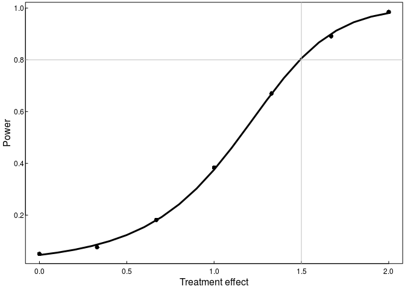

<style>

blockquote {
background-color: #a6bddb50;
font-family: "helvetica";
font-size:110%;
}

blockquote li{
padding-bottom:10px;
}

svg {
width:none;
height:none;
}

</style>
Background
----------

A pharmaceutical company has been commissioned to rapidly develop a new antibiotic that will be more effective against a specific bacterial infection that is highly resistant to standard therapy. To speed up development the research team has decided to simultaneously test 10 new candidate medications against standard therapy in a randomized controlled trial. This has created methodological challenges the biostatistical team is working to resolve.

They have agreed on a study design that will collect the study outcome (infection resolved or not resolved within 14 days) on 400-500 patients for the standard therapy (control arm) and 50-100 patients for each of the 10 candidate therapies (intervention arms). For sake of estimating the operational characteristics of the proposed analysis approaches, they assume each of the sample sizes will be uniformly distributed within those ranges. They will also assume all patients' outcomes will be independent of each other and the probability of resolution under standard therapy is 0.10.

A group of biostatisticians (ONE) is concerned about controlling for the familywise Type I error (FWER) for testing the 10 treatments against the control group all at once. They propose first performing a single chi-square test on all 11 groups to test for any differences. This test would be evaluated at a 5% significance level. If it was not significant, they would conclude there were no differences in resolution rates. If it was significant, they would then individually test each of the treatments against the control with a chi-square test each at a 5% significance level. Any of those tests that returned p- values &lt; 0.05 would be deemed statistically significant.

Another group of biostatisticians (TWO) is concerned about controlling for the FWER without losing too much Power. They propose going straight to individually testing each of the treatments against the control with chi-square tests, but doing a Bonferroni correction to maintain a 5% familywise error rate. Any of those tests that returned p- values less than this threshold would be deemed statistically significant.

A third group of biostatisticians (THREE) is concerned about not focusing on what is clinically meaningful and meaningless. They ask the researchers what a clinically meaningful improvement would be. The researchers reply around a 15% absolute gain, e.g. if the control had a 10% resolution rate, a treatment with a 25% rate would be truly meaningful. Then the biostatisticians ask what would be a clinically trivial change from the standard therapy. The team replies anything within a 2% absolute difference, e.g. going from 10% to 12%, would be trivial -- essentially meaningless. Group THREE proposes calculating the 95% confidence intervals for the risk difference for each of the 10 interventions vs the control, and deeming any interval that falls above a 2% absolute improvement to be clinically nontrivial, i.e. when the CI has a lower bound &gt; 0.02.

For the tests, all the biostatisticians agree on using the default chi-square test function in R, chisq.test(), with the default function settings. For the risk difference confidence intervals, they agree to use the Agresti-Caffo interval as implemented by the wald2ci() function in the R package PropCIs.

Questions
---------

<blockquote>
The questions that follow require you to perform a simulation study. Please remember the tgs axioms of computing:

1.  **The act of turning on the computer does not magically endow you with understanding of your task.** If you do not know how you will perform an analysis or simulation before you turn on your computer, you will not know how to do it afterwards either.

2.  **Use modular/functional programming.** Functional programming means that you identify and write short, single purpose functions for each distinct task in your program. (Examples below.) This will allow you to develop your code in a systematic way, and it will provide a natural method for debugging your code. You will simply need to verify that the different sub-functions are working as expected.

### Big picture for simulation studies

Here is a conceptual diagram for how one might think about type I or type II error rates (or any other operating characteristic) for an analysis procedure. In a typical setting, there are population parameters that one hopes to estimate by collecting and analyzing data. The population parameters are unknown, and the accuracy of the conclusions is unknown.

\[1\] "&lt;?xml version="1.0" encoding="UTF-8" standalone="no"?&gt;&lt;!DOCTYPE svg PUBLIC "-//W3C//DTD SVG 1.1//EN""[http://www.w3.org/Graphics/SVG/1.1/DTD/svg11.dtd\\](http://www.w3.org/Graphics/SVG/1.1/DTD/svg11.dtd\)"&gt;<!-- Generated by graphviz version 2.40.1 (20161225.0304)\n --><!-- Title: boxes_and_circles Pages: 1 -->&lt;svg width="795pt" height="173pt"viewBox="0.00 0.00 795.29 172.65" xmlns="[http://www.w3.org/2000/svg\\](http://www.w3.org/2000/svg\)" xmlns:xlink="[http://www.w3.org/1999/xlink\\](http://www.w3.org/1999/xlink\)"&gt;&lt;g id="graph0" class="graph" transform="scale(1 1) rotate(0) translate(4 168.6492)"&gt;
<title>
boxes\_and\_circles
</title>
<polygon fill=\"#ffffff\" stroke=\"transparent\" points=\"-4,4 -4,-168.6492 791.2852,-168.6492 791.2852,4 -4,4\"/>&lt;g id="clust1" class="cluster"&gt;
<title>
cluster2
</title>
<polygon fill=\"none\" stroke=\"#ffffff\" points=\"141.8928,-63.7028 141.8928,-151.7028 661.8928,-151.7028 661.8928,-63.7028 141.8928,-63.7028\"/></g><!-- A -->&lt;g id="node1" class="node"&gt;
<title>
A
</title>
&lt;ellipse fill="none" stroke="\#000000" cx="56.9464" cy="-107.7028" rx="56.8929" ry="56.8929"/&gt;&lt;text text-anchor="middle" x="56.9464" y="-111.9028" font-family="Times,serif" font-size="14.00" fill="\#000000"&gt;(Unknown)</text>&lt;text text-anchor="middle" x="56.9464" y="-95.1028" font-family="Times,serif" font-size="14.00" fill="\#000000"&gt;Parameters</text></g><!-- B -->&lt;g id="node2" class="node"&gt;
<title>
B
</title>
<polygon fill=\"none\" stroke=\"#000000\" points=\"293.8928,-143.7028 149.8928,-143.7028 149.8928,-71.7028 293.8928,-71.7028 293.8928,-143.7028\"/>&lt;text text-anchor="middle" x="221.8928" y="-103.5028" font-family="Times,serif" font-size="14.00" fill="\#000000"&gt;Collect data</text></g><!-- A&#45;&gt;B -->&lt;g id="edge3" class="edge"&gt;
<title>
A-&gt;B
</title>
<path fill=\"none\" stroke=\"#000000\" d=\"M114.1738,-107.7028C122.3998,-107.7028 130.9966,-107.7028 139.591,-107.7028\"/><polygon fill=\"#000000\" stroke=\"#000000\" points=\"139.6565,-111.2029 149.6565,-107.7028 139.6565,-104.2029 139.6565,-111.2029\"/></g><!-- D --><!-- A&#45;&gt;D --><!-- C -->&lt;g id="node3" class="node"&gt;
<title>
C
</title>
<polygon fill=\"none\" stroke=\"#000000\" points=\"473.8928,-143.7028 329.8928,-143.7028 329.8928,-71.7028 473.8928,-71.7028 473.8928,-143.7028\"/>&lt;text text-anchor="middle" x="401.8928" y="-111.9028" font-family="Times,serif" font-size="14.00" fill="\#000000"&gt;Analyze data</text>&lt;text text-anchor="middle" x="401.8928" y="-95.1028" font-family="Times,serif" font-size="14.00" fill="\#000000"&gt; Make conclusion</text></g><!-- B&#45;&gt;C -->&lt;g id="edge1" class="edge"&gt;
<title>
B-&gt;C
</title>
<path fill=\"none\" stroke=\"#000000\" d=\"M294.0686,-107.7028C302.4128,-107.7028 310.9699,-107.7028 319.4373,-107.7028\"/><polygon fill=\"#000000\" stroke=\"#000000\" points=\"319.701,-111.2029 329.7009,-107.7028 319.7009,-104.2029 319.701,-111.2029\"/></g><!-- C&#45;&gt;D --><!-- E --><!-- D&#45;&gt;E --></g></svg>"

In a simulation setting, the researcher sets the population parameters then generates data using the parameters. After completing the analysis, the researcher can then evaluate the accuracy of the conclusions. If the research repeats this process several times, then she/he can estimate the long-run operating characteristics of the analysis procedure *for the specific set of population parameters*.

\[1\] "&lt;?xml version="1.0" encoding="UTF-8" standalone="no"?&gt;&lt;!DOCTYPE svg PUBLIC "-//W3C//DTD SVG 1.1//EN""[http://www.w3.org/Graphics/SVG/1.1/DTD/svg11.dtd\\](http://www.w3.org/Graphics/SVG/1.1/DTD/svg11.dtd\)"&gt;<!-- Generated by graphviz version 2.40.1 (20161225.0304)\n --><!-- Title: boxes_and_circles Pages: 1 -->&lt;svg width="792pt" height="192pt"viewBox="0.00 0.00 791.97 192.14" xmlns="[http://www.w3.org/2000/svg\\](http://www.w3.org/2000/svg\)" xmlns:xlink="[http://www.w3.org/1999/xlink\\](http://www.w3.org/1999/xlink\)"&gt;&lt;g id="graph0" class="graph" transform="scale(1 1) rotate(0) translate(4 188.1431)"&gt;
<title>
boxes\_and\_circles
</title>
<polygon fill=\"#ffffff\" stroke=\"transparent\" points=\"-4,4 -4,-188.1431 787.9669,-188.1431 787.9669,4 -4,4\"/>&lt;g id="clust1" class="cluster"&gt;
<title>
cluster2
</title>
<polygon fill=\"none\" stroke=\"#0000ff\" points=\"138.5745,-63.1431 138.5745,-176.1431 658.5745,-176.1431 658.5745,-63.1431 138.5745,-63.1431\"/>&lt;text text-anchor="middle" x="398.5745" y="-159.5431" font-family="Times,serif" font-size="14.00" fill="\#000000"&gt;Repeat M times</text></g><!-- A -->&lt;g id="node1" class="node"&gt;
<title>
A
</title>
&lt;ellipse fill="none" stroke="\#000000" cx="55.2873" cy="-107.1431" rx="55.0753" ry="55.0753"/&gt;&lt;text text-anchor="middle" x="55.2873" y="-111.3431" font-family="Times,serif" font-size="14.00" fill="\#000000"&gt;Set</text>&lt;text text-anchor="middle" x="55.2873" y="-94.5431" font-family="Times,serif" font-size="14.00" fill="\#000000"&gt;Parameters</text></g><!-- B -->&lt;g id="node2" class="node"&gt;
<title>
B
</title>
<polygon fill=\"none\" stroke=\"#000000\" points=\"290.5745,-143.1431 146.5745,-143.1431 146.5745,-71.1431 290.5745,-71.1431 290.5745,-143.1431\"/>&lt;text text-anchor="middle" x="218.5745" y="-102.9431" font-family="Times,serif" font-size="14.00" fill="\#000000"&gt;Generate data</text></g><!-- A&#45;&gt;B -->&lt;g id="edge3" class="edge"&gt;
<title>
A-&gt;B
</title>
<path fill=\"none\" stroke=\"#000000\" d=\"M111.0248,-107.1431C119.1925,-107.1431 127.7462,-107.1431 136.309,-107.1431\"/><polygon fill=\"#000000\" stroke=\"#000000\" points=\"136.3426,-110.6432 146.3425,-107.1431 136.3425,-103.6432 136.3426,-110.6432\"/></g><!-- D -->&lt;g id="node4" class="node"&gt;
<title>
D
</title>
<polygon fill=\"none\" stroke=\"#000000\" points=\"650.5745,-143.1431 506.5745,-143.1431 506.5745,-71.1431 650.5745,-71.1431 650.5745,-143.1431\"/>&lt;text text-anchor="middle" x="578.5745" y="-119.7431" font-family="Times,serif" font-size="14.00" fill="\#000000"&gt;Compare conclusion</text>&lt;text text-anchor="middle" x="578.5745" y="-102.9431" font-family="Times,serif" font-size="14.00" fill="\#000000"&gt;to truth</text>&lt;text text-anchor="middle" x="578.5745" y="-86.1431" font-family="Times,serif" font-size="14.00" fill="\#000000"&gt;Error/No error?</text></g><!-- A&#45;&gt;D -->&lt;g id="edge5" class="edge"&gt;
<title>
A:se-&gt;D:s
</title>
<path fill=\"none\" stroke=\"#000000\" d=\"M94.2873,-68.1431C167.9347,5.5044 552.6105,34.5907 577.3275,-61.1595\"/><polygon fill=\"#000000\" stroke=\"#000000\" points=\"573.862,-61.654 578.5745,-71.1431 580.808,-60.7863 573.862,-61.654\"/></g><!-- C -->&lt;g id="node3" class="node"&gt;
<title>
C
</title>
<polygon fill=\"none\" stroke=\"#000000\" points=\"470.5745,-143.1431 326.5745,-143.1431 326.5745,-71.1431 470.5745,-71.1431 470.5745,-143.1431\"/>&lt;text text-anchor="middle" x="398.5745" y="-111.3431" font-family="Times,serif" font-size="14.00" fill="\#000000"&gt;Analyze data</text>&lt;text text-anchor="middle" x="398.5745" y="-94.5431" font-family="Times,serif" font-size="14.00" fill="\#000000"&gt; Make conclusion</text></g><!-- B&#45;&gt;C -->&lt;g id="edge1" class="edge"&gt;
<title>
B-&gt;C
</title>
<path fill=\"none\" stroke=\"#000000\" d=\"M290.7503,-107.1431C299.0945,-107.1431 307.6516,-107.1431 316.119,-107.1431\"/><polygon fill=\"#000000\" stroke=\"#000000\" points=\"316.3826,-110.6432 326.3826,-107.1431 316.3826,-103.6432 316.3826,-110.6432\"/></g><!-- C&#45;&gt;D -->&lt;g id="edge2" class="edge"&gt;
<title>
C-&gt;D
</title>
<path fill=\"none\" stroke=\"#000000\" d=\"M470.7503,-107.1431C479.0945,-107.1431 487.6516,-107.1431 496.119,-107.1431\"/><polygon fill=\"#000000\" stroke=\"#000000\" points=\"496.3826,-110.6432 506.3826,-107.1431 496.3826,-103.6432 496.3826,-110.6432\"/></g><!-- E -->&lt;g id="node5" class="node"&gt;
<title>
E
</title>
&lt;ellipse fill="none" stroke="\#000000" cx="735.2707" cy="-107.1431" rx="48.8932" ry="48.8932"/&gt;&lt;text text-anchor="middle" x="735.2707" y="-119.7431" font-family="Times,serif" font-size="14.00" fill="\#000000"&gt;Calculate</text>&lt;text text-anchor="middle" x="735.2707" y="-102.9431" font-family="Times,serif" font-size="14.00" fill="\#000000"&gt;error</text>&lt;text text-anchor="middle" x="735.2707" y="-86.1431" font-family="Times,serif" font-size="14.00" fill="\#000000"&gt;rate</text></g><!-- D&#45;&gt;E -->&lt;g id="edge4" class="edge"&gt;
<title>
D-&gt;E
</title>
<path fill=\"none\" stroke=\"#000000\" d=\"M650.9598,-107.1431C659.4174,-107.1431 667.9681,-107.1431 676.2147,-107.1431\"/><polygon fill=\"#000000\" stroke=\"#000000\" points=\"676.468,-110.6432 686.468,-107.1431 676.4679,-103.6432 676.468,-110.6432\"/></g></g></svg>"

The framework described above suggests how one my write modular code to perform the simulation. One can write a function to perform each of the primary tasks. For example:

\[1\] "&lt;?xml version="1.0" encoding="UTF-8" standalone="no"?&gt;&lt;!DOCTYPE svg PUBLIC "-//W3C//DTD SVG 1.1//EN""[http://www.w3.org/Graphics/SVG/1.1/DTD/svg11.dtd\\](http://www.w3.org/Graphics/SVG/1.1/DTD/svg11.dtd\)"&gt;<!-- Generated by graphviz version 2.40.1 (20161225.0304)\n --><!-- Title: boxes_and_circles Pages: 1 -->&lt;svg width="805pt" height="198pt"viewBox="0.00 0.00 804.66 198.41" xmlns="[http://www.w3.org/2000/svg\\](http://www.w3.org/2000/svg\)" xmlns:xlink="[http://www.w3.org/1999/xlink\\](http://www.w3.org/1999/xlink\)"&gt;&lt;g id="graph0" class="graph" transform="scale(1 1) rotate(0) translate(4 194.4113)"&gt;
<title>
boxes\_and\_circles
</title>
<polygon fill=\"#ffffff\" stroke=\"transparent\" points=\"-4,4 -4,-194.4113 800.6605,-194.4113 800.6605,4 -4,4\"/>&lt;g id="clust1" class="cluster"&gt;
<title>
cluster2
</title>
<polygon fill=\"none\" stroke=\"#0000ff\" points=\"171.9002,-69.4113 171.9002,-182.4113 691.9002,-182.4113 691.9002,-69.4113 171.9002,-69.4113\"/>&lt;text text-anchor="middle" x="431.9002" y="-165.8113" font-family="Times,serif" font-size="14.00" fill="\#000000"&gt;Repeat M times</text></g><!-- A -->&lt;g id="node1" class="node"&gt;
<title>
A
</title>
&lt;ellipse fill="none" stroke="\#000000" cx="71.9501" cy="-113.4113" rx="71.9002" ry="71.9002"/&gt;&lt;text text-anchor="middle" x="71.9501" y="-117.6113" font-family="monospace" font-size="14.00" fill="\#000000"&gt;Parameters:</text>&lt;text text-anchor="middle" x="71.9501" y="-100.8113" font-family="monospace" font-size="14.00" fill="\#000000"&gt;c(N=100, θ=1)</text></g><!-- B -->&lt;g id="node2" class="node"&gt;
<title>
B
</title>
<polygon fill=\"none\" stroke=\"#000000\" points=\"323.9002,-149.4113 179.9002,-149.4113 179.9002,-77.4113 323.9002,-77.4113 323.9002,-149.4113\"/>&lt;text text-anchor="middle" x="251.9002" y="-109.2113" font-family="monospace" font-size="14.00" fill="\#000000"&gt;generate\_data()</text></g><!-- A&#45;&gt;B -->&lt;g id="edge3" class="edge"&gt;
<title>
A-&gt;B
</title>
<path fill=\"none\" stroke=\"#000000\" d=\"M144.1058,-113.4113C152.4477,-113.4113 161.0025,-113.4113 169.4675,-113.4113\"/><polygon fill=\"#000000\" stroke=\"#000000\" points=\"169.7283,-116.9114 179.7283,-113.4113 169.7282,-109.9114 169.7283,-116.9114\"/></g><!-- D -->&lt;g id="node4" class="node"&gt;
<title>
D
</title>
<polygon fill=\"none\" stroke=\"#000000\" points=\"683.9002,-149.4113 539.9002,-149.4113 539.9002,-77.4113 683.9002,-77.4113 683.9002,-149.4113\"/>&lt;text text-anchor="middle" x="611.9002" y="-109.2113" font-family="monospace" font-size="14.00" fill="\#000000"&gt;oper\_char()</text></g><!-- A&#45;&gt;D -->&lt;g id="edge5" class="edge"&gt;
<title>
A:se-&gt;D:s
</title>
<path fill=\"none\" stroke=\"#000000\" d=\"M122.9501,-62.4113C197.3402,11.9788 585.6883,30.1477 610.6413,-67.2905\"/><polygon fill=\"#000000\" stroke=\"#000000\" points=\"607.1925,-67.9198 611.9002,-77.4113 614.139,-67.0557 607.1925,-67.9198\"/></g><!-- C -->&lt;g id="node3" class="node"&gt;
<title>
C
</title>
<polygon fill=\"none\" stroke=\"#000000\" points=\"503.9002,-149.4113 359.9002,-149.4113 359.9002,-77.4113 503.9002,-77.4113 503.9002,-149.4113\"/>&lt;text text-anchor="middle" x="431.9002" y="-109.2113" font-family="monospace" font-size="14.00" fill="\#000000"&gt;analysis()</text></g><!-- B&#45;&gt;C -->&lt;g id="edge1" class="edge"&gt;
<title>
B-&gt;C
</title>
<path fill=\"none\" stroke=\"#000000\" d=\"M324.0759,-113.4113C332.4201,-113.4113 340.9772,-113.4113 349.4447,-113.4113\"/><polygon fill=\"#000000\" stroke=\"#000000\" points=\"349.7083,-116.9114 359.7083,-113.4113 349.7082,-109.9114 349.7083,-116.9114\"/></g><!-- C&#45;&gt;D -->&lt;g id="edge2" class="edge"&gt;
<title>
C-&gt;D
</title>
<path fill=\"none\" stroke=\"#000000\" d=\"M504.0759,-113.4113C512.4201,-113.4113 520.9772,-113.4113 529.4447,-113.4113\"/><polygon fill=\"#000000\" stroke=\"#000000\" points=\"529.7083,-116.9114 539.7083,-113.4113 529.7082,-109.9114 529.7083,-116.9114\"/></g><!-- E -->&lt;g id="node5" class="node"&gt;
<title>
E
</title>
&lt;ellipse fill="none" stroke="\#000000" cx="758.2803" cy="-113.4113" rx="38.2607" ry="38.2607"/&gt;&lt;text text-anchor="middle" x="758.2803" y="-109.2113" font-family="monospace" font-size="14.00" fill="\#000000"&gt;mean()</text></g><!-- D&#45;&gt;E -->&lt;g id="edge4" class="edge"&gt;
<title>
D-&gt;E
</title>
<path fill=\"none\" stroke=\"#000000\" d=\"M684.2326,-113.4113C692.8423,-113.4113 701.4678,-113.4113 709.6325,-113.4113\"/><polygon fill=\"#000000\" stroke=\"#000000\" points=\"709.6921,-116.9114 719.6921,-113.4113 709.692,-109.9114 709.6921,-116.9114\"/></g></g></svg>"

### Example

Consider the example of a clinical trial comparing length-of-stay between a new surgical approach and a traditional surgical approach. With the traditional surgical approach, length-of-stay follows a mixture distribution. One fourth of the patients stay zero days in the hospital. The other portion have a length-of-stay distribution that follows a discretized, shifted-by-one exponential with a mean of 4 days.

The researchers believe the new approach will not alter the number of subjects that will stay zero nights. Rather, they believe that it will reduce the length-of-stay among patients that stay at least one night.

The primary endpoint will be analyzed with a Wilcoxon two sample test.

Researchers want to know the minimal detectable difference at 80% power if they enroll 150 patients in each arm.

``` r
require(magrittr, quietly = TRUE)

parameters <- c(N = 150, trt_effect = 1)

generate_data <- function(parameters){
  N <- parameters[1]
  trt_effect <- parameters[2]
  trt <- rep(0:1, each = N)
  G <- rbinom(2*N, 1, p = 0.75)
  means <- 4 - 1 - trt_effect*trt
  Y_tmp <- 1 + rexp(2*N, 1/means) %>% floor
  Y <- Y_tmp*G + 0*(1-G)
  
  data.frame(Y = Y, trt = trt)
}

analysis <- function(D, alpha = 0.05){
  wilcox.test(Y~trt, data = D)$p.value < alpha
}

# This function isn't needed for this particular simulation, 
# but it might be helpful for the simulation in the qualifying exam.
oper_char <- function(x) 1*x

one_rep <- function(parameters) parameters %>% generate_data %>% analysis %>% oper_char
# Note that sim_params = c(M, parameters)
M_rep <- function(sim_params) replicate(sim_params[1], one_rep(sim_params[2:3]))
```

#### Simulation Settings & Simulation

``` r
ss1 <- expand.grid(
    M = 1e4
  , N = 150
  , trt_effect = seq(0, 2, by = 1/3) %>% round(2)
  , power = NA
)

# Uses previous results if available
if("simulation-results.rds" %in% list.files()){
  ss1 <- readRDS("simulation-results.rds")
}else{
  for(i in 1:nrow(ss1)){ss1[i,4] <- ss1[i,1:3] %>% as.numeric %>% M_rep %>% mean}  
  saveRDS(ss1, "simulation-results.rds")
}
```

#### Results

``` r
ss1 %>% kable
```

|      M|    N|  trt\_effect|   power|
|------:|----:|------------:|-------:|
|  10000|  150|         0.00|  0.0524|
|  10000|  150|         0.33|  0.0751|
|  10000|  150|         0.67|  0.1838|
|  10000|  150|         1.00|  0.3935|
|  10000|  150|         1.33|  0.6565|
|  10000|  150|         1.67|  0.8970|
|  10000|  150|         2.00|  0.9846|

#### Plot

``` r
tgsify::plotstyle(style = upright)
plot(ss1$trt_effect, ss1$power, xlab = "Treatment effect", ylab = "Power")
lm1 <- glm(power ~ poly(trt_effect, degree = 3, raw = TRUE), data = ss1, family = binomial)
xx <- seq(0,2,by=.1)
power_smooth <- predict(lm1, newdata = data.frame(trt_effect = xx), type = "response")
lines(xx, power_smooth, lwd = 3)
abline(h = 0.8, col = "grey")
(power_smooth - 0.8) %>% abs %>% which.min %>% `[`(xx, .) %>% abline(v = ., col = "grey")
```


</blockquote>
1.  Write a brief paragraph comparing the familywise Type I error rates (FWER) of the three analysis methods (Proposals ONE, TWO, and THREE) for testing the 10 new therapies versus the control therapy. Report your error rates to three decimal places and design your methods so you have a high degree of certainty on the first two decimal places. <br><br> Write a second paragraph describing your methods for estimating these error rates in detail and provide supporting code and figures as appropriate. – Note: Clearly explaining what you were trying to do is very important if it turns out you have an error in your code. It helps the graders give you partial credit. <br> <br>
    <blockquote>
    **Suggestions:**
    <ul>
    <li>
    Write the functions <tt>generate\_data()</tt>, <tt>analysis1()</tt>, <tt>analysis2()</tt>, <tt>analysis3()</tt>, <tt>fwer()</tt>.
    <li>
    Write <tt>generate\_data()</tt> so that one of the inputs is a vector of event probabilities corresponding to each arm of the study.
    <li>
    Write the analysis functions in a way that the input and output is exactly the same.
    <li>
    Write <tt>fwer()</tt> in a way so that it calculates the fwer regardless of the analysis method.
    <li>
    Write a <tt>one\_rep()</tt> function so that each generated dataset is analyzed by all three methods. Perhaps the output is a triple.
    </ul>
    </blockquote>
2.  Write a brief paragraph offering intuition on why each the three methods behaved the way they did in part a. Attempt to explain why each method either 1) achieved a FWER of 5% exactly, 2) was conservative by achieving a FWER less than 5%, or 3) failed to keep FWER under 5%.

3.  Write a brief paragraph comparing the Power of the three analysis methods (Proposals ONE, TWO, and THREE) for detecting that one new treatment, call it treatment A, is different than the control therapy assuming treatment A has a resolution rate of 26% and all the other therapies retain the control rate of 10%. Here Power is referring to the probability of detecting the effect of treatment A specifically. Missing the effect of A and finding a false positive effect in a different therapy doesn't count as a successful study. Report your Power estimates to three decimal places and design your methods so you have a high degree of certainty on the first two decimal places.<br> <br> Write a second paragraph describing your methods for estimating the Power in detail and provide supporting code and figures as appropriate.<br> <br>
    <blockquote>
    **Suggestion:** You should be able to complete this step by writing 1 additional function and reusing the code from part (a).
    </blockquote>
4.  Write a brief paragraph commenting on which method had the best Power out of the methods that controlled FWER at 5% or less. Attempt to offer insight into why the best performing method outperformed the others.

5.  Assume that the settings for parts a and c were the only two scenarios that could occur with non-negligible probability and that they were equally likely to happen. Write a brief paragraph commenting on the False Discovery and False Non-Discovery Rates of the three approaches.<br> <br> Write a second paragraph describing your methods for estimating the FDR and FNR in detail and provide supporting code and figures as appropriate. After the study was done and it was being analyzed, analysts wouldn’t omnisciently know there is at most one real effect like we are assuming here. So it is important to allow the methods to potentially find more than one significant result in a given study.<br> <br> <br>
    <blockquote>
    **Suggestion:** You'll need to write an additional function for this step. It will also require you two output more than a single number from the <tt>oper\_char()</tt> function.
    </blockquote>
6.  Explain why the FDR and FNR are of interest to the statisticians designing the study. Attempt to offer insight into why the best performing method outperformed the others.
